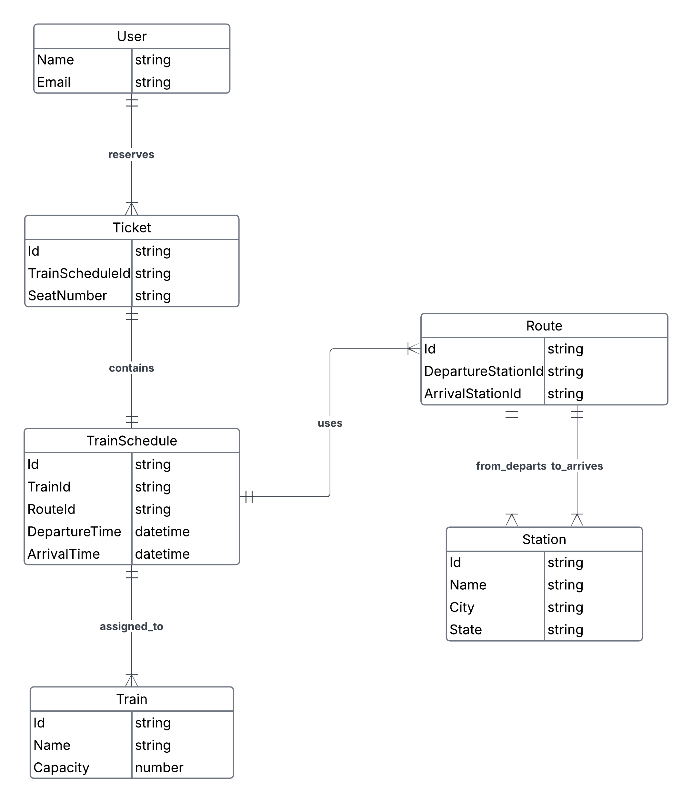

## Railway Reservation/Ticketing System

This is a backend implementation of a Train reservation System which allows interested users to search for train schedules, reserve tickets, and manage their reservations.

### ER Diagram Overview

* A user can make reservations. This will generate a ticket for the user.
* A reservation is linked to a train schedule.
* A train schedule consists of a train (which has a given capacity) and a route (which connects stations).
* A user can reserve multiple tickets for the same schedule.

### Features
* Spring boot

### Technologies Used
* Spring boot
* Spring data JDBC
* JPQL
* Flyway
* Maven