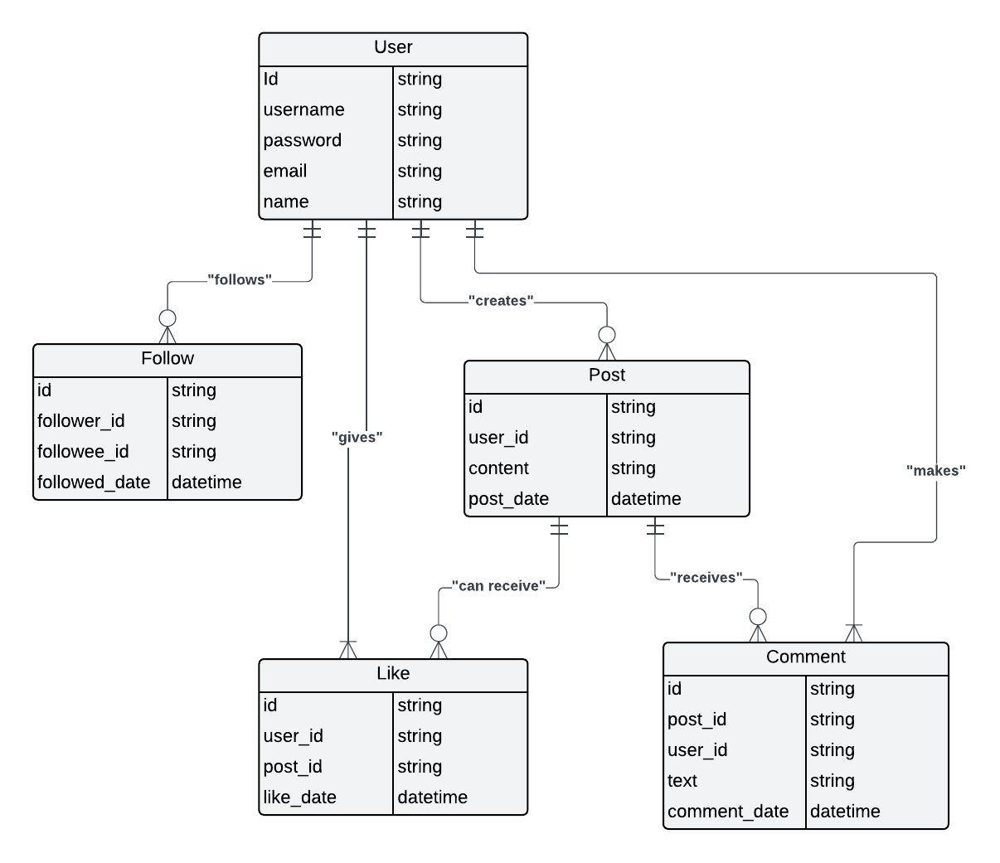

## Database schema for a Social media platform

This is a schema for a social media site that is designed to detail the relationships between the entities in a database. The entities include `User` and `Post`, with their corresponding attributes. There's also entities such as `Like`, `Comment` and `Follow`. `User` has a one-to-many relationship with `Post`, `Like` has a many-to-one relationship with both `User` and `Post`. The entities contain key attributes like `id`, `text`, and `date`. It includes all necessary details for a comprehensive understanding of the relationship between the data. The attached SQL file contains the scripts for persisting such data into a (MySQL) database.

### ER Diagram showing the relationships between the entities


### Example of a single user's info in JSON
```
{
    "id": "123",
	"username": "janedoe",
    "name": "Jane Doe",
    "email": "jane@example.com",
    "password": "hashedpassword",
    "posts": [
        {
            "id": "456",
            "text": "Hello, world!",
            "date": "2025–01–10",
            "comments": [
                {
                    "comment_id": "789",
                    "user_id": "456",
                    "text": "Nice post!",
                    "date": "2025–01–10"
                }
            ],
            "likes": [
                {
                    "id": "1011",
                    "user_id": "789",
                    "date": "2025–01–10"
                }
            ]
        },
        {
            "id": "1012",
            "text": "I love document databases!",
            "date": "2025–01–11",
            "comments": [],
            "likes": []
        }
    ],
    "followers": [
        {
            "user_id": "456",
            "name": "John Smith"
        },
        {
            "user_id": "789",
            "name": "Alice Johnson"
        }
    ],
    "following": [
        {
            "user_id": "456",
            "name": "John Smith"
        },
        {
            "user_id": "789",
            "name": "Alice Johnson"
        }
    ]
}
```